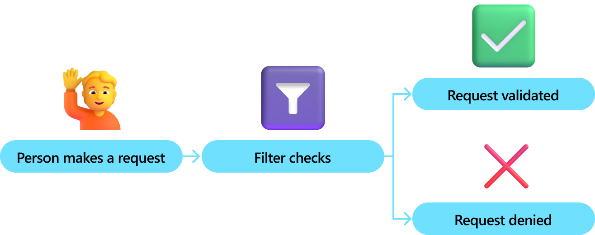

# What are Filters?

Filters enhance security by providing control and visibility over how and when functions run. This is needed to instill responsible AI principles into your work so that you feel confident your solution is enterprise ready.
 
For example, filters are leveraged to validate permissions before an approval flow begins. The IFunctionInvocationFilter is run to check the permissions of the person that’s looking to submit an approval. This means that only a select group of people will be able to kick off the process.
 
 

Data validation is done asynchronously which means you’ll need to provide all required information in the right format to continue. This prevents malicious actors from getting through because if the data they input doesn’t match the records on file, they are instantly stopped.
