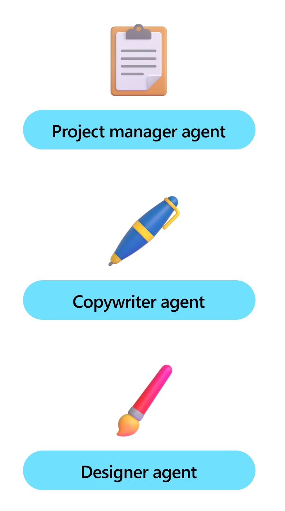

# Personas: Giving your Agent a Role


:::row:::
   :::column span="3":::
     Often called a "meta prompt" or "instruction", the persona is a prompt that is used to influence how the agent responds to stimuli. This allows you to influence how your agents plan tasks, generate responses, and interact with users. For example, you can use the persona to explicitly tell the agent to ask for help if it doesn't know what to do, or to be more verbose when it is explaining something.

     In Semantic Kernel, we often describe these prompts as "personas" because they're very similar to persona in user experience design. Just like how designers and UX researchers create personas to represent different types of users and the jobs-to-be-done they have, you can create personas to represent different types of agents and the tasks they are responsible for.

     By doing so, you can create agents that are more consistent, more reliable, and more predictable. This is especially important when you're building agents that are responsible for critical tasks or that interact with users in sensitive situations.
   :::column-end:::
   :::column span="2":::
        
   :::column-end:::
:::row-end:::

The rest of this article will provide tips and best practices when creating personas in Semantic Kernel.

## Best practices for creating personas

Creating effective personas involves careful consideration of the agent's intended role, the target audience, and the specific tasks the agent will perform. Here are some best practices to keep in mind:

### 1. Define clear objectives
Before creating a persona, clearly define the objectives you want the agent to achieve. This includes understanding the tasks the agent will perform and the type of interactions you expect it to have users.

### 2. Reference specific roles or public figures
A well-defined persona should include specific details about the agent's behavior, tone, and style. Avoid vague descriptions by referencing specific roles or public figures so that the LLM can better mimic their behavior.

### 3. Provide examples and scenarios
To help the agent understand its role better, provide examples and scenarios that illustrate the persona in action. This can include sample conversations, user stories, or use cases that demonstrate how the agent should respond in different situations.

### 4. Include fallback instructions
Provide instructions on what the agent should do when it encounters an unknown situation or is unable to provide a response. This can include asking for help, providing alternative solutions, or simply acknowledging that it doesn't have an answer.

### 5. Iterate and Refine
Personas are not static. Continuously test and refine your personas based on user feedback and performance data. This helps in improving the agent's effectiveness over time.

## Using system messages to set personas

The most common system messages used within Semantic Kernel are the user, assistant, and tool messages. These messages are used to simulate a conversation between the user and the agent.

A forth message type, the system message, can be used to provide the agent with additional context or instructions that isn't shown to the user. This can be used to set the persona for the agent.

In Semantic Kernel, providing an initial system message for the agent is as simple as adding it in the `ChatHistory` constructor. For example:

```csharp
ChatHistory chatHistory = new("""
   You are a technical support specialist for a software company. Your primary task is to assist users with technical issues, such as installation problems, software bugs, and feature inquiries. Use technical jargon appropriately, but ensure that explanations are easy to understand. If a problem is too complex, suggest advanced troubleshooting steps or escalate to a higher-level support team using the escalate tool.
   """)
```

If you need greater control over the persona (for example, you want to change the instructions as the conversation progresses), you can use the `AddSystemMessage` method to add additional system messages to the chat history.

```csharp
chatHistory.AddSystemMessage("Remember to ask for help if you're unsure how to proceed.")
```

By reminding the LLM of its personas in this way, you can ensure that your agent is consistent, reliable, and predictable in its interactions with users.

## Next steps

Now that you understand the importance of personas in Semantic Kernel, you can start creating your own personas to influence how your agents respond to stimuli.

To learn more about creating effective prompts (both for personas and other purposes), check out the [prompts article](./prompts.md).

> [!div class="nextstepaction"]
> [Authoring prompts in Semantic Kernel](./prompts.md)