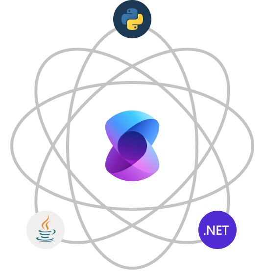

# Semantic Kernel: the enterprise AI SDK

:::row:::
   :::column span="2":::
        Semantic Kernel is an open-source SDK that lets you easily build agents that can call your existing code. What makes Semantic Kernel unique is its focus on enterprise scenarios. As an SDK that used by Microsoft and Fortune 500 companies alike, Semantic Kernel prioritizes the specific needs of enterprise developers with features like Open Telemetry support, hooks/filters, and non-breaking version updates across all SDKs.

        As a lightweight framework, Semantic Kernel can easily plug into your existing codebase and connect it to AI models from OpenAI, Azure OpenAI, Hugging Face, and more. With SDKs available in C#, Python, and Java, you can also use the same SDK across your AI researchers and enterprise app developers to quickly take prototypes and deploy them to your customers.
   :::column-end:::
   :::column span="":::
    
   :::column-end:::
:::row-end:::

## Automating business processes with AI

Today's AI models can easily generate messages and images. While this is helpful for building chat apps, it’s not enough to build enterprise solutions that fully automate business processes. To do so, you need an SDK that can combine prompts with existing APIs to perform real work in the real world. Semantic Kernel does just that.

With Semantic Kernel, you can easily describe your existing code to AI models so they can invoke them to address user needs. Whenever an LLM asks for a function to be invoked, Semantic Kernel then does the heavy lifting of translating the model's request into an actual function call and subsequently passes the results back to the LLM.

## Semantic Kernel is enterprise first

To support the needs of enterprise app developers, Semantic Kernel is designed to be scalable, observable, and safe. With features like Open Telemetry support, you can easily monitor your agents in production, and with hooks/filters, you can ensure that you always have control over what your agents do. This is different than other SDK that prioritize research and experimentation over production readiness.

Unlike other other AI SDKs, Semantic Kernel is also _extremely_ lightweight. This means that you can easily integrate it into your existing codebase without layers of overly opinionated implementations of AI that will become obsolete in a few months. As a principle, Semantic Kernel is designed to be a thin layer that connects your code directly to AI models without getting in they way. As models evolve, you can easily swap them out without having to rewrite your entire codebase.

Lastly, with version 1.0+ support across C#, Python, and Java, you can also be confident that your investment in Semantic Kernel will be supported for years to come without breaking changes. The Semantic Kernel team is confident in the stability of the API because it models how humans interact with each other via chat. As AIs begin to support additional modalities like voice and video, Semantic Kernel will be able to easily support these new modalities as simple extensions to the existing chat-based APIs.

## Designed for modular extensibility

:::row:::
   :::column span="":::
      With Semantic Kernel, you'll be equipped to build future-proof solutions that evolve with your needs. Easily add your existing code through plugins to maximize your investment and innovation potential and flexibly integrate new and exiting AI services through a set of out-of-the-box connectors. 

      Together, with plugins and AI services, you can begin automating business process for you company and your customers. For example, if you built plugins to interact with a CRM system, you could use Semantic Kernel to orchestrate calls to get customers, email customers, and complete sales with models from Azure OpenAI, OpenAI, Mistral or Gemini.
      
      Because Semantic Kernel uses OpenAPI specifications (just like Microsoft 365 Copilot), you can also easily share the extensions you build for Semantic Kernel with other developers (whether pro-dev or citizen-dev) within your company.
   :::column-end:::
   :::column span="":::
    
   :::column-end:::
:::row-end:::

## Get started

Now that you know what Semantic Kernel is, try it out using the quick start guide. Within minutes you’ll be able to build an agent that can automatically call functions to perform actions for the user.

> [!div class="nextstepaction"]
> [Quickly get started](../get-started/quick-start-guide.md)